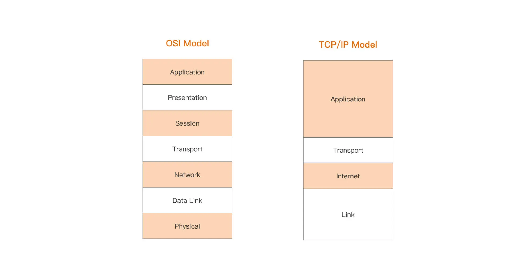
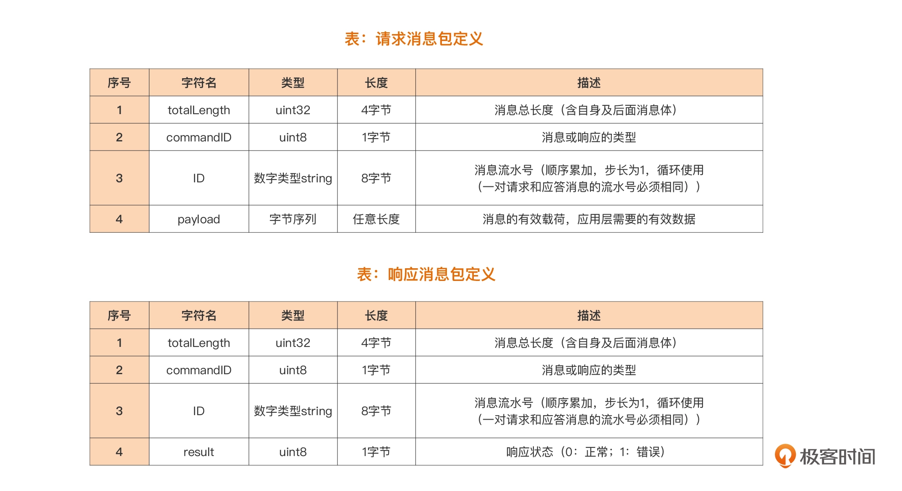
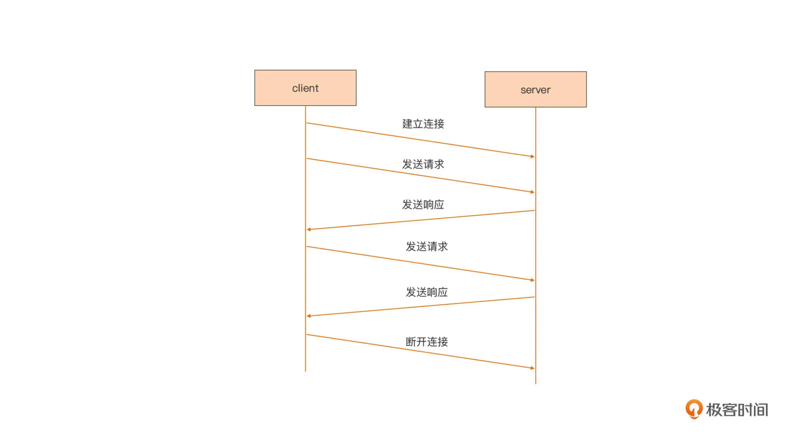
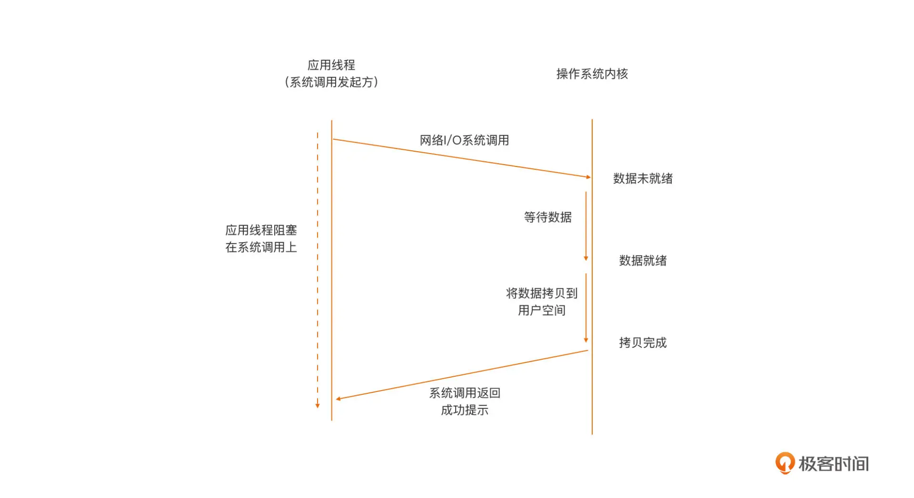
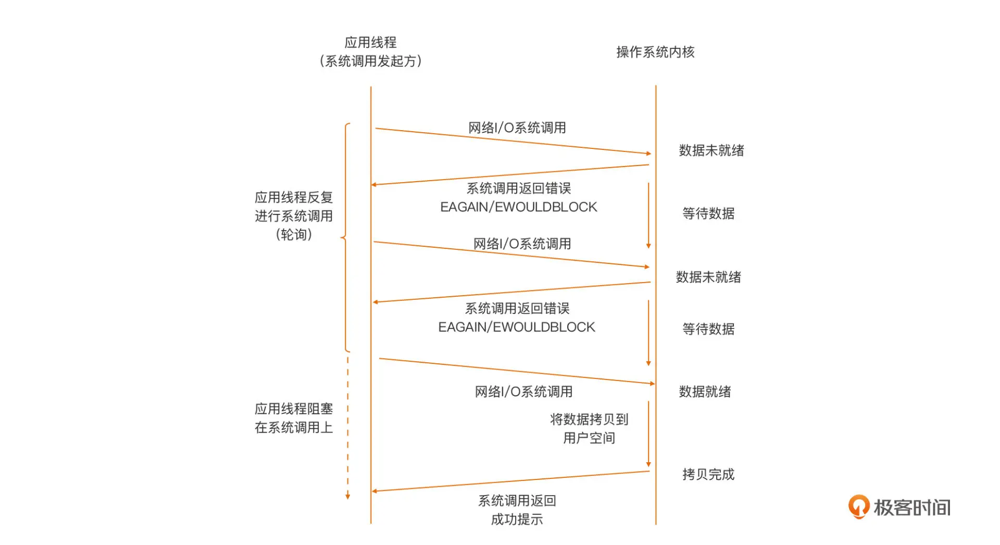
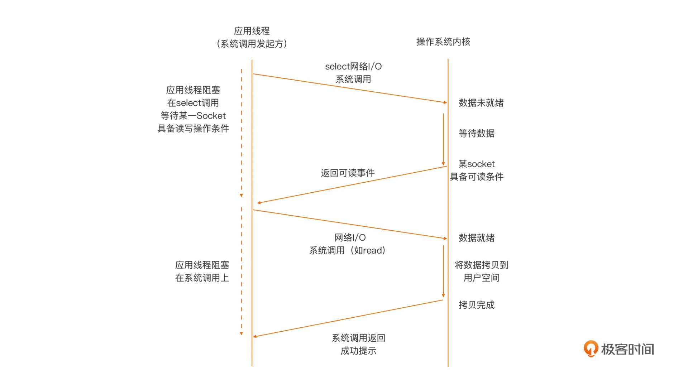

# MyTCP
TCP/IP Model

通常来说，我们更多关注 OSI 网络模型中的传输层（四层）与应用层（七层），也就是 TCP/IP 网络模型中的最上面两层。

TCP/IP 网络模型，实现了两种传输层协议：TCP 和 UDP。TCP 是面向连接的流协议，为通信的两端提供稳定可靠的数据传输服务；而 UDP 则提供了一种无需建立连接就可以发送数据包的方法。两种协议各有擅长的应用场景。

我们日常开发中使用最多的是 TCP 协议。基于 TCP 协议，我们实现了各种各样的满足用户需求的应用层协议。比如，我们常用的 HTTP 协议就是应用层协议的一种，而且是使用得最广泛的一种。而基于 HTTP 的 Web 编程就是一种针对应用层的网络编程。我们还可以基于传输层暴露给开发者的编程接口，实现应用层的自定义应用协议。

Note Http协议基于 TCP协议

## 问题描述

我们面临的实际问题是这样的：实现一个基于 TCP 的自定义应用层协议的通信服务端。

我们的输入，是一个基于传输层自定义的应用层协议规范。由于 TCP 是面向连接的流协议传输机制，数据流本身没有明显的边界，这样定义协议时，就需要自行定义确定边界的方法，因此，基于 TCP 的自定义应用层协议通常有两种常见的定义模式：

- 二进制模式：采用长度字段标识独立数据包的边界。采用这种方式定义的常见协议包括 MQTT（物联网最常用的应用层协议之一）、SMPP（短信网关点对点接口协议）等；
- 文本模式：采用特定分隔符标识流中的数据包的边界，常见的包括 HTTP 协议等。

使用这个协议的通信两端的通信流程：

socket 是传输层给用户提供的编程接口，一旦通过 socket 将双方的连接建立后，剩下的就是通过网络 I/O 操作在两端收发数据了

## TCP Socket 编程模型

TCP Socket 诞生以来，它的编程模型，也就是网络 I/O 模型已几经演化。网络 I/O 模型定义的是应用线程与操作系统内核之间的交互行为模式。我们通常用阻塞（Blocking）/非阻塞（Non-Blocking）来描述网络 I/O 模型。

阻塞 / 非阻塞，是以内核是否等数据全部就绪后，才返回（给发起系统调用的应用线程）来区分的。

如果内核一直等到全部数据就绪才返回，这种行为模式就称为阻塞。

如果内核查看数据就绪状态后，即便没有就绪也立即返回错误（给发起系统调用的应用线程），那么这种行为模式则称为非阻塞。

阻塞 I/O(Blocking I/O)

非阻塞 I/O（Non-Blocking I/O）

和阻塞 I/O 模型正相反，在非阻塞模型下，当用户空间线程向操作系统内核发起 I/O 请求后，内核会执行这个 I/O 操作，如果这个时候数据尚未就绪，就会立即将“未就绪”的状态以错误码形式（比如：EAGAIN/EWOULDBLOCK），返回给这次 I/O 系统调用的发起者。而后者就会根据系统调用的返回状态来决定下一步该怎么做。

在非阻塞模型下，位于用户空间的 I/O 请求发起者通常会通过轮询的方式，去一次次发起 I/O 请求，直到读到所需的数据为止。不过，这样的轮询是对 CPU 计算资源的极大浪费，因此，非阻塞 I/O 模型单独应用于实际生产的比例并不高。

I/O 多路复用（I/O Multiplexing）

为了避免非阻塞 I/O 模型轮询对计算资源的浪费，同时也考虑到阻塞 I/O 模型的低效，开发人员首选的网络 I/O 模型，逐渐变成了建立在内核提供的多路复用函数 select/poll 等（以及性能更好的 epoll 等函数）基础上的 I/O 多路复用模型。

从图中我们看到，在这种模型下，应用线程首先将需要进行 I/O 操作的 Socket，都添加到多路复用函数中（这里以 select 为例），然后阻塞，等待 select 系统调用返回。当内核发现有数据到达时，对应的 Socket 具备了通信条件，这时 select 函数返回。然后用户线程会针对这个 Socket 再次发起网络 I/O 请求，比如一个 read 操作。由于数据已就绪，这次网络 I/O 操作将得到预期的操作结果。

用户态分成了两步， 1. 发起io操作，然后阻塞 2. 收到回调，再针对socket发起一次io操作，比如read

我们看到，相比于阻塞模型一个线程只能处理一个 Socket 的低效，I/O 多路复用模型中，一个应用线程可以同时处理多个 Socket。同时，I/O 多路复用模型由内核实现可读 / 可写事件的通知，避免了非阻塞模型中轮询，带来的 CPU 计算资源浪费的问题。

目前，主流网络服务器采用的都是“I/O 多路复用”模型，有的也结合了多线程。不过，I/O 多路复用模型在支持更多连接、提升 I/O 操作效率的同时，也给使用者带来了不小的复杂度，以至于后面出现了许多高性能的 I/O 多路复用框架，比如：libevent、libev、libuv等，以帮助开发者简化开发复杂性，降低心智负担。

